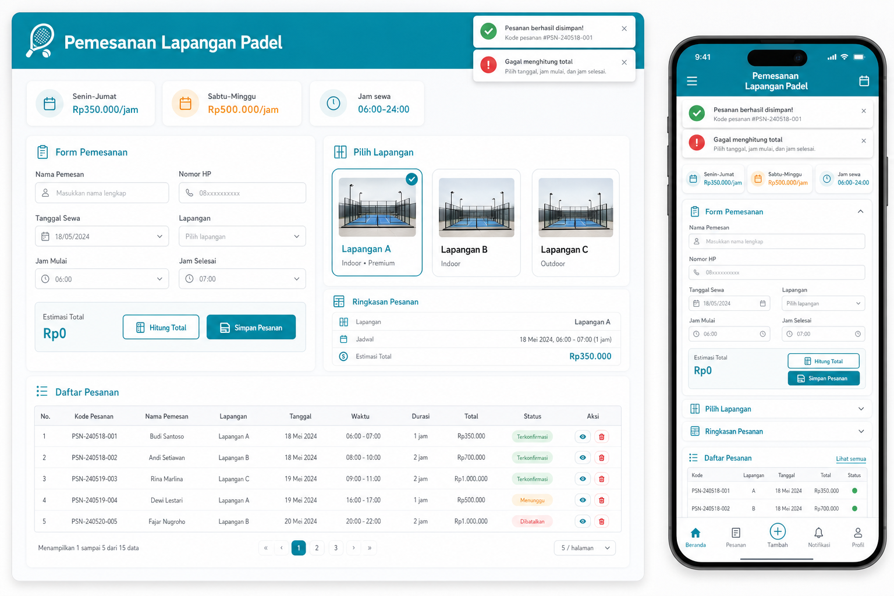

# Aplikasi Pemesanan Lapangan Padel

Aplikasi web sederhana untuk pemesanan lapangan padel menggunakan:
- PHP native + `mysqli` (backend API)
- MySQL (berjalan otomatis di Docker Compose)
- HTML + Tailwind CSS (frontend)
- JavaScript vanilla (interaksi form, hitung, simpan, dan daftar pesanan)
- Docker (runtime aplikasi)

## Mockup UI



## Struktur File

- `index.html`: halaman utama (UI frontend).
- `script.js`: logika frontend (toast alert, hitung, simpan, render tabel).
- `api.php`: endpoint backend (`list`, `hitung`, `pesan`).
- `config.php`: loader `.env` dan koneksi database.
- `table.sql`: query membuat tabel `pemesanan`.
- `index.php`: redirect ke `index.html`.
- `pemesanan.php`: redirect ke `index.html`.
- `Dockerfile`: image PHP + ekstensi `mysqli`.
- `docker-compose.yml`: jalankan container aplikasi.

## Konfigurasi Database

Secara default database sudah dibuat oleh Docker Compose, jadi tidak perlu install MySQL di host.

Konfigurasi default:

```env
DB_HOST=mysql
DB_PORT=3306
DB_USER=padel
DB_PASSWORD=padel_password
DB_NAME=db_pemesanan
```

Catatan:
- Service MySQL bernama `mysql`.
- Data database disimpan di volume Docker `mysql-data`.
- Tabel `pemesanan` dibuat otomatis saat container aplikasi start.

## Setup Tabel

File `table.sql` tetap disediakan untuk dokumentasi struktur tabel. Saat memakai Docker Compose, file ini dijalankan otomatis oleh container PHP saat aplikasi start.

```sql
CREATE TABLE IF NOT EXISTS pemesanan (
    id INT AUTO_INCREMENT PRIMARY KEY,
    nama VARCHAR(100) NOT NULL,
    no_hp VARCHAR(20) NOT NULL,
    lapangan VARCHAR(50) NOT NULL,
    tanggal_sewa DATE NOT NULL,
    jam_mulai TIME NOT NULL,
    jam_selesai TIME NOT NULL,
    durasi INT NOT NULL,
    harga_per_jam INT NOT NULL,
    total_tagihan INT NOT NULL,
    created_at TIMESTAMP DEFAULT CURRENT_TIMESTAMP
);
```

## Jalankan Dengan Docker

Mode Docker ini build langsung dari source code lokal di repo ini, jadi setiap perubahan terbaru akan ikut ke image saat `docker compose up --build`.

Docker Compose akan menjalankan:
- `padel-web`: aplikasi PHP native.
- `mysql`: database MySQL internal.

Di root project:

```bash
docker compose up -d --build
```

Buka aplikasi:

```text
http://localhost:8000/index.html
```

Stop container:

```bash
docker compose down
```

## Endpoint API

- `GET /api.php?action=list`
  - Ambil daftar semua pesanan.
- `POST /api.php?action=hitung`
  - Hitung durasi, harga per jam, dan total tagihan (tanpa simpan).
- `POST /api.php?action=pesan`
  - Validasi + hitung + simpan pesanan ke database.

## Aturan Harga

- Jam sewa valid: `06:00` sampai `24:00`.
- Senin-Jumat: `Rp350.000/jam`.
- Sabtu-Minggu: `Rp500.000/jam`.
- Durasi = selisih jam selesai dan jam mulai.
- Jika `jam_selesai <= jam_mulai`, maka error.
- Jika jam di luar rentang, maka error.
